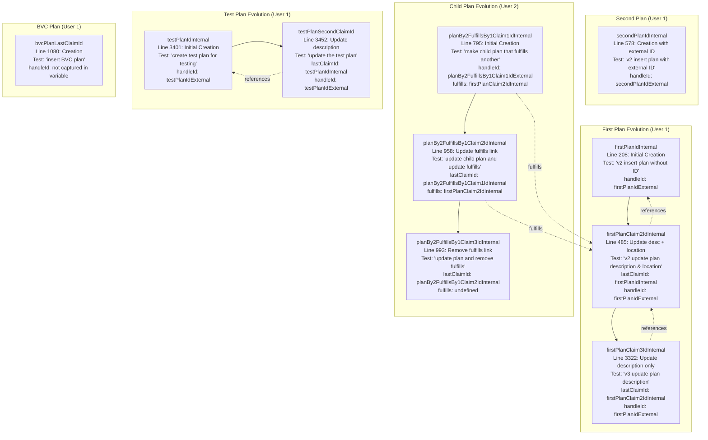

# Test Documentation

This folder contains comprehensive tests for the Endorser API, with detailed scenarios for plan management, JWT claims, and change detection functionality.

## Controller Endorser 6 Tests

The `controller-endorser-6-plans-totals.js` test file creates a sequence of plan JWTs that evolve over time, providing rich test data for validating the `plansLastUpdatedBetween` endpoint and related functionality.

### Timeline Overview

```mermaid
gantt
    title Plan-Creation Timeline in Test 6
    dateFormat X
    axisFormat %s
    
    section First Plan (User 1)
    Created firstPlanIdInternal             :milestone, m1, 1, 0d
    Updated firstPlanClaim2IdInternal       :milestone, m2, 3, 0d  
    Edited firstPlanClaim3IdInternal        :milestone, m3, 21, 0d

    section Second Plan (User 1)
    Created secondPlanIdInternal            :milestone, m4, 5, 0d

    section Child Plan (User 2)
    Created planBy2...Claim1IdInternal      :milestone, m5, 7, 0d
    Updated fulfills planBy2...Claim2IdInternal  :milestone, m6, 9, 0d
    Removed fulfills planBy2...Claim3IdInternal  :milestone, m7, 11, 0d

    section BVC Plan (User 1)
    Created bvcPlanLastClaimId              :milestone, m8, 13, 0d

    section Test Plan (User 1)
    Created testPlanIdInternal              :milestone, m9, 23, 0d
    Updated testPlanSecondClaimId           :milestone, m10, 25, 0d
```

### Detailed JWT Evolution Graph

