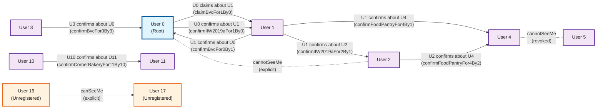
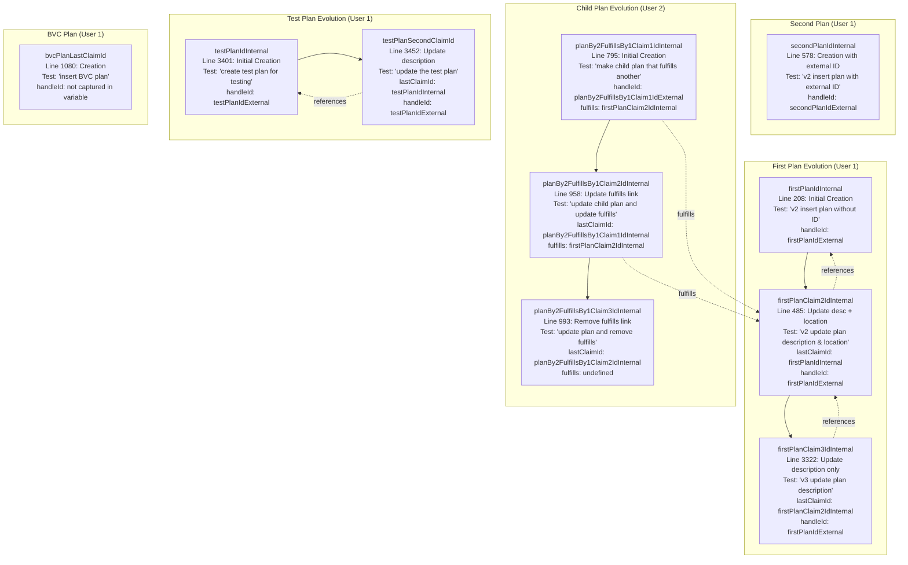

# Test Documentation

This folder contains comprehensive tests for the Endorser API, with detailed scenarios for plan management, JWT claims, and change detection functionality.

## Registration Tree

```mermaid
graph TD
    U0["User 0<br/>0x000...<br/>(Root)"]
    
    U0 --> U1["User 1<br/>0x111..."]
    U0 --> U2["User 2<br/>0x222..."]
    U0 --> U3["User 3<br/>0x333..."]
    U0 --> U4["User 4<br/>0x444..."]
    U0 --> U5["User 5<br/>0x555..."]
    U0 --> U6["User 6<br/>0x666..."]
    U0 --> U7["User 7<br/>0x777..."]
    U0 --> U8["User 8<br/>0x888..."]
    U0 --> U9["User 9<br/>0x999..."]
    U0 --> U10["User 10<br/>0xAAA..."]
    U0 --> U11["User 11<br/>0xBBB..."]
    U0 --> U12["User 12<br/>0xCCC..."]
    U0 --> U13["User 13<br/>0xDDD..."]
    U0 --> U14["User 14<br/>0xEEE..."]
    U0 --> U15["User 15<br/>0xFFF..."]
    
    U1 --> U16["User 16<br/>0xaaa..."]
    U2 --> U17["User 17<br/>0xbbb..."]
    U2 --> U18["User 18<br/>0xccc..."]
    
    style U0 fill:#e1f5ff,stroke:#01579b,stroke-width:3px,color:#1a1a1a
    style U1 fill:#f3e5f5,stroke:#4a148c,stroke-width:2px,color:#1a1a1a
    style U2 fill:#f3e5f5,stroke:#4a148c,stroke-width:2px,color:#1a1a1a
    style U3 fill:#f3e5f5,stroke:#4a148c,stroke-width:2px,color:#1a1a1a
    style U4 fill:#f3e5f5,stroke:#4a148c,stroke-width:2px,color:#1a1a1a
    style U5 fill:#f3e5f5,stroke:#4a148c,stroke-width:2px,color:#1a1a1a
    style U6 fill:#f3e5f5,stroke:#4a148c,stroke-width:2px,color:#1a1a1a
    style U7 fill:#f3e5f5,stroke:#4a148c,stroke-width:2px,color:#1a1a1a
    style U8 fill:#f3e5f5,stroke:#4a148c,stroke-width:2px,color:#1a1a1a
    style U9 fill:#f3e5f5,stroke:#4a148c,stroke-width:2px,color:#1a1a1a
    style U10 fill:#f3e5f5,stroke:#4a148c,stroke-width:2px,color:#1a1a1a
    style U11 fill:#f3e5f5,stroke:#4a148c,stroke-width:2px,color:#1a1a1a
    style U12 fill:#f3e5f5,stroke:#4a148c,stroke-width:2px,color:#1a1a1a
    style U13 fill:#f3e5f5,stroke:#4a148c,stroke-width:2px,color:#1a1a1a
    style U14 fill:#f3e5f5,stroke:#4a148c,stroke-width:2px,color:#1a1a1a
    style U15 fill:#f3e5f5,stroke:#4a148c,stroke-width:2px,color:#1a1a1a
    style U16 fill:#fff3e0,stroke:#e65100,stroke-width:2px,color:#1a1a1a
    style U17 fill:#fff3e0,stroke:#e65100,stroke-width:2px,color:#1a1a1a
    style U18 fill:#fff3e0,stroke:#e65100,stroke-width:2px,color:#1a1a1a
```

**Legend:**
- **User 0** (blue): Root user who registered all other users
- **Users 1-15** (purple): All registered directly by User 0
- **Users 16-18** (orange): Second-level users registered in "Deeper Tree" tests
  - User 16 registered by User 1
  - Users 17 & 18 registered by User 2
- **Arrows**: Show registration direction (registrar → registered user)

**Registration Details:**
- User 0 is the root of the registration tree via SQL for "maxRegs: 17" in `controller-endorser-0-setup.js`
- Later updates are via `registrationUpdateMaxClaimsForTests`
- The "Deeper Tree" registrations in `controller-partner-3-nearest-neighbor.js` create a multi-level tree for testing cousin relationships and deeper path traversal

## Visibility Graph

This graph shows the "can see" relationships established in the test suite. There are two ways visibility is granted:

1. **Explicit visibility via `canSeeMe` or hiding via `cannotSeeMe` endpoints**: A user explicitly allows another user to see or not see them
2. **Implicit visibility via claims**: When an issuer makes a claim about someone else, that person can see the issuer

**Legend:**
- **Solid arrows (→)**: Active "can see" relationships
  - **"canSeeMe (explicit)"**: User explicitly granted visibility via `/api/claim/canSeeMe` endpoint
  - **"claim about X"**: Issuer made a claim about another user, granting that user visibility to the issuer
- **Dashed lines (-.-)**: Revoked or blocked visibility
  - **"cannotSeeMe"**: User explicitly blocked visibility via `/api/claim/cannotSeeMe` endpoint
- **Arrow direction**: Points from the visible user to the viewer (e.g., `U4 → U5` means User 5 can see User 4)

**Key Test Scenarios:**
1. **Implicit visibility through claims** (lines 1074-1096):
2. **Explicit visibility toggle** (lines 1829-1901):
3. **Explicit invisibility** (lines 1649-1680):
4. **Unregistered users** (lines 1839-1847):
   - Shows that visibility system works even without registration
   - Test: `unregistered #16 should set visible to unregistered #17`
5. **Claim-based visibility chains** (lines 1953-1997):
   - Creates transitive visibility paths through the network

## Controller Endorser 6 Tests

The `controller-endorser-6-plans-totals.js` test file creates a sequence of plan JWTs that evolve over time, providing rich test data for validating the `plansLastUpdatedBetween` endpoint and related functionality.

### Timeline Overview

```mermaid
gantt
    title Plan-Creation Timeline in Test 6
    dateFormat X
    axisFormat %s
    
    section First Plan (User 1)
    Created firstPlanIdInternal             :milestone, m1, 1, 0d
    Updated firstPlanClaim2IdInternal       :milestone, m2, 3, 0d  
    Edited firstPlanClaim3IdInternal        :milestone, m3, 21, 0d

    section Second Plan (User 1)
    Created secondPlanIdInternal            :milestone, m4, 5, 0d

    section Child Plan (User 2)
    Created planBy2...Claim1IdInternal      :milestone, m5, 7, 0d
    Updated fulfills planBy2...Claim2IdInternal  :milestone, m6, 9, 0d
    Removed fulfills planBy2...Claim3IdInternal  :milestone, m7, 11, 0d

    section BVC Plan (User 1)
    Created bvcPlanLastClaimId              :milestone, m8, 13, 0d

    section Test Plan (User 1)
    Created testPlanIdInternal              :milestone, m9, 23, 0d
    Updated testPlanSecondClaimId           :milestone, m10, 25, 0d
```

### Detailed JWT Evolution Graph

