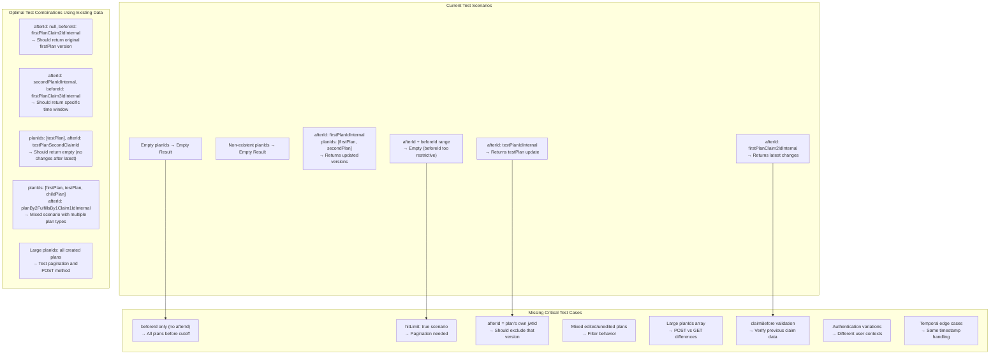

# Comprehensive Test Scenarios for plansLastUpdatedBetween Endpoint

This document outlines the test coverage gaps and optimal test combinations for the `plansLastUpdatedBetween` endpoint based on the analysis of existing test data in `controller-endorser-6-plans-totals.js`.

## Test Coverage Analysis



## Available Test Data from Controller Endorser 6

Based on the plan JWT timeline established in the test file, we have these variables available:

### Plan Evolution Chains
```javascript
// First Plan (User 1) - 3 versions
firstPlanIdExternal, firstPlanIdInternal          // T1: Initial creation
firstPlanClaim2IdInternal                         // T3: Updated desc+location  
firstPlanClaim3IdInternal                         // T21: Updated description

// Second Plan (User 1) - Single version
secondPlanIdExternal, secondPlanIdInternal        // T5: Creation with external ID

// Child Plan (User 2) - 3 versions with relationship changes
planBy2FulfillsBy1Claim1IdExternal, planBy2FulfillsBy1Claim1IdInternal  // T7: Created
planBy2FulfillsBy1Claim2IdInternal                // T9: Updated fulfills link
planBy2FulfillsBy1Claim3IdInternal                // T11: Removed fulfills link

// Test Plan (User 1) - 2 versions
testPlanIdExternal, testPlanIdInternal            // T23: Created for testing
testPlanSecondClaimId                             // T25: Updated

// BVC Plan (User 1) - Single version
bvcPlanLastClaimId                                // T13: Community plan
```

## Recommended Test Scenarios

### A. BeforeId-Only Queries (Missing Coverage)
```javascript
// Test: Plans before a specific point in time
{
  planIds: [firstPlanIdExternal],
  beforeId: firstPlanClaim2IdInternal
}
// Expected: Should return firstPlanIdInternal (original version)
// Purpose: Validates beforeId-only filtering works correctly
```

### B. Time Window Queries (Enhanced Coverage)
```javascript
// Test: Plans updated within specific time window
{
  planIds: [firstPlanIdExternal, planBy2FulfillsBy1Claim1IdExternal],
  afterId: firstPlanIdInternal,
  beforeId: planBy2FulfillsBy1Claim2IdInternal
}
// Expected: Should return plans updated between T1 and T9
// Purpose: Validates time window filtering across multiple plan types
```

### C. Self-Exclusion Edge Cases (Missing Coverage)
```javascript
// Test: afterId equals plan's own latest jwtId
{
  planIds: [testPlanIdExternal],
  afterId: testPlanSecondClaimId
}
// Expected: Should return empty array (no changes after latest)
// Purpose: Validates edge case where afterId excludes the plan itself
```

### D. Mixed Edit States (Missing Coverage)
```javascript
// Test: Plans with different edit histories
{
  planIds: [firstPlanIdExternal, secondPlanIdExternal, testPlanIdExternal],
  afterId: firstPlanClaim2IdInternal
}
// Expected: Mix of edited (firstPlan, testPlan) and unedited (secondPlan) plans
// Purpose: Validates behavior with plans in different edit states
```

### E. Large Array Scenarios (Missing Coverage)
```javascript
// Test: Many plans to trigger pagination
{
  planIds: [
    firstPlanIdExternal, secondPlanIdExternal, 
    planBy2FulfillsBy1Claim1IdExternal, testPlanIdExternal,
    // Add more plan IDs from the many plans created in test
  ],
  afterId: null
}
// Expected: Should test hitLimit behavior and POST vs GET differences
// Purpose: Validates pagination and method differences
```

### F. ClaimBefore Validation (Critical Gap)
```javascript
// Test: Verify claimBefore structure and content
{
  planIds: [firstPlanIdExternal],
  afterId: firstPlanIdInternal
}
// Expected: claimBefore should contain valid JWT claim data
// Current Issue: claimBefore often undefined in existing tests
// Purpose: Validates the previous claim context feature works correctly
```

## Implementation Priority

### High Priority (Critical Gaps)
1. **ClaimBefore Validation** - Current implementation appears broken
2. **Self-Exclusion Edge Cases** - Common client usage pattern
3. **BeforeId-Only Queries** - Missing core functionality

### Medium Priority (Enhanced Coverage)
4. **Mixed Edit States** - Real-world scenario testing
5. **Time Window Queries** - Complex filtering validation
6. **Authentication Variations** - Different user contexts

### Low Priority (Performance/Edge Cases)
7. **Large Array Scenarios** - Pagination behavior
8. **Temporal Edge Cases** - Same timestamp handling
9. **Error Condition Coverage** - Malformed inputs

## Test Implementation Notes

### Known Issues to Address
1. **claimBefore undefined**: Many tests show this field as undefined when it should contain previous claim data
2. **beforeId filtering confusion**: Current behavior filters after plan selection, not during
3. **API design issues**: Tests comment "usually isn't what a client would want"

### Recommended Test Structure
```javascript
describe('plansLastUpdatedBetween - Comprehensive Scenarios', () => {
  // Use the existing plan variables from controller-endorser-6
  
  it('beforeId-only returns plans before cutoff', () => {
    // Test scenario A
  });
  
  it('self-exclusion when afterId equals latest jwtId', () => {
    // Test scenario C
  });
  
  it('claimBefore contains valid previous claim data', () => {
    // Test scenario F - Critical for API contract
  });
  
  // ... additional scenarios
});
```

This comprehensive approach leverages the existing rich test data while addressing critical gaps in the current test coverage for the `plansLastUpdatedBetween` endpoint.
